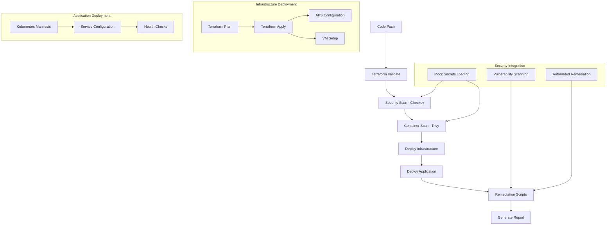

# CI/CD Pipeline Documentation

GitHub Actions workflow that orchestrates the DevSecOps pipeline for the FinServe. Demonstrates security-first practices, automated testing, and infrastructure deployment.

## Pipeline Architecture



## Workflow Overview

Triggered manually via `workflow_dispatch` for full control over deployments.

### Job Structure

#### 1. Terraform Validate
- Format checking and syntax validation
- Checkov security analysis
- Terraform plan generation
- Mock secrets configuration loading

#### 2. Security Scan
- Trivy container vulnerability scanning
- Filesystem security analysis
- Configurable severity levels (HIGH, CRITICAL)
- SARIF report generation

#### 3. Deploy and Test
- Infrastructure deployment via Terraform
- AKS cluster and VM setup
- nginx-hello application deployment
- Post-deployment health checks

#### 4. Remediation
- Automated VM patching via Azure Run Command
- Security updates application
- Remediation success verification

#### 5. Report
- Security summary generation
- Deployment status reporting
- Key metrics collection

## Security Integration

### Mock Secrets Management
```yaml
- name: Load mock Key Vault configuration
  run: |
    source ../scripts/read-vault-config.sh
    export_vault_config
```

### Vulnerability Scanning
- **Trivy** - Container vulnerability scanning with configurable severity
- **Checkov** - Infrastructure security analysis
- **SARIF reports** - GitHub security tab integration

### Automated Remediation
- **VM patching** - Azure Run Command for remote updates
- **Configuration updates** - System packages and security configs
- **Success verification** - Automated validation of changes

## Engineering Notes

- **Manual triggers** - Full control over deployments, cost management
- **Separate jobs** - Parallel execution, failure isolation, artifact sharing
- **Mock secrets** - Demonstrates security principles without external dependencies
- **Branch protection** - Required status checks, no direct pushes, review requirements

## Monitoring Integration

Pipeline outputs integrate with monitoring:
- VM IP address for Node Exporter
- AKS cluster name for kubectl
- Resource group for Azure management
- Service endpoints for health checks
