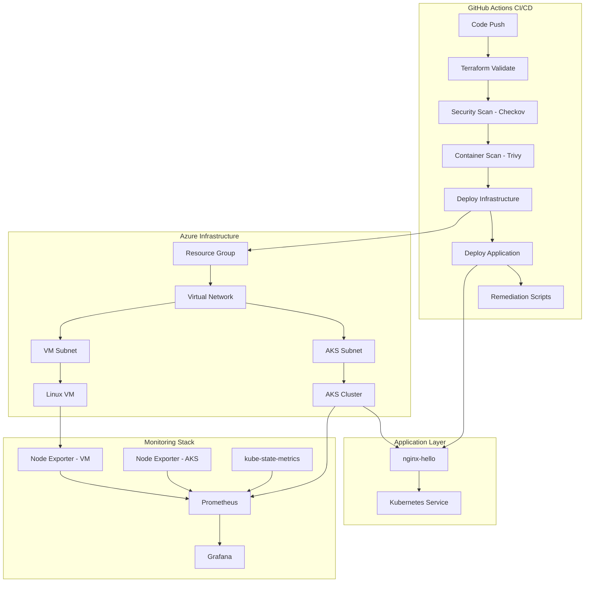

# FinServe DevSecOps

A DevSecOps implementation built for Finserve Ltd, focusing on Azure infrastructure automation with security-first practices. The project demonstrates how to set up a complete pipeline from code to production, including infrastructure provisioning, security scanning, and comprehensive monitoring.

## Overview

The project delivers a production-ready DevSecOps pipeline that spans from infrastructure provisioning to comprehensive monitoring. Built with Azure-native services and industry-standard tooling, it demonstrates security-first practices while maintaining operational efficiency.

## Architecture



## Key Components

### Infrastructure (Terraform)
- **Multi-environment support** with workspace-based configuration
- **Modular design** with separate network, AKS, and VM modules
- **Security-first networking** with NSGs and subnet isolation
- **Local state management** (remote backend configuration deferred for assessment scope)

### CI/CD Pipeline (GitHub Actions)
- **Security integration** with Trivy container scanning and Checkov IaC analysis
- **Automated remediation** using Azure Run Command for VM patching
- **Branch protection** requiring pipeline success before merge
- **Mock secrets management** for configuration abstraction

### Monitoring (Prometheus + Grafana)
- **Comprehensive metrics collection** from both AKS cluster and standalone VM
- **Custom dashboards** for infrastructure health, pod monitoring, and resource utilization
- **Automated deployment** via Helm with environment-specific configuration

## Getting Started

### Prerequisites
- Azure CLI configured with appropriate permissions
- kubectl for Kubernetes cluster management
- Helm for monitoring stack deployment
- Terraform 1.5.0+

### Quick Start

1. **Deploy Infrastructure**
   ```bash
   cd terraform
   terraform init
   terraform workspace select staging
   terraform apply
   ```

2. **Set up Monitoring**
   ```bash
   cd monitoring
   make install-prometheus
   make install-node-exporter
   make port-forward
   ```

3. **Access Dashboards**
   - Grafana: http://localhost:3000 (admin/admin123)
   - Prometheus: http://localhost:9090

## Documentation

- **[Infrastructure Details](terraform/README.md)** - Terraform modules, networking, and deployment strategies
- **[Monitoring Setup](monitoring/README.md)** - Prometheus configuration, Grafana dashboards, and metrics explanation
- **[Pipeline Documentation](.github/workflows/README.md)** - CI/CD workflow, security integration, and automation scripts
- **[Scripts & Automation](scripts/README.md)** - Mock secrets management and remediation tools

## Security Features

- **Container vulnerability scanning** with Trivy integration
- **Infrastructure security analysis** using Checkov
- **Automated remediation** for identified vulnerabilities
- **Secrets abstraction** through mock Key Vault implementation
- **Network security groups** with least-privilege access

## Monitoring Capabilities

- **Infrastructure metrics** from both AKS and standalone VM
- **Application health monitoring** with pod-level visibility
- **Resource utilization tracking** for CPU, memory, and network
- **Custom dashboards** tailored for operational insights


## Technical Decisions

This implementation includes several engineering choices worth noting:

- **Local Terraform state** - Remote backend configuration was deferred to focus on core functionality
- **Mock secrets management** - JSON-based configuration abstraction for demonstration purposes
- **Ephemeral monitoring storage** - EmptyDir volumes for simplicity in assessment environment
- **Manual monitoring deployment** - Post-infrastructure setup to avoid pipeline complexity


---

*This project demonstrates modern DevSecOps practices suitable for financial services environments, balancing security requirements with operational efficiency.*
