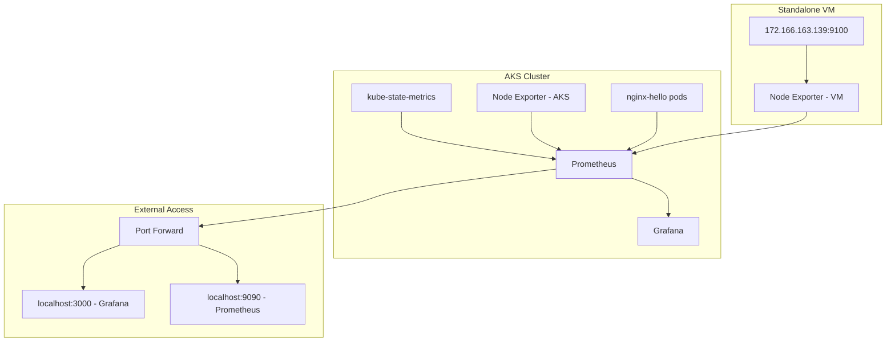

# Monitoring & Observability

Complete monitoring stack for the FinServe Ltd. Covers both AKS cluster and standalone VM with Prometheus and Grafana.

## Architecture



## What We're Monitoring

### Infrastructure Metrics
- CPU utilization across all nodes (AKS and VM)
- Memory usage and available capacity
- Disk I/O and filesystem health
- Network traffic and connectivity

### Kubernetes Metrics
- Pod status and restart counts
- Resource requests vs limits
- Node conditions and scheduling
- Service endpoints and load balancing

### Application Metrics
- nginx-hello deployment health
- Container resource consumption
- Service availability and response times

## Dashboards

### VM Monitoring Dashboard
Tracks the standalone Linux VM (172.166.163.139) with Node Exporter metrics - CPU, memory, disk, and network activity.

### Cluster Node Exporter Dashboard
Monitors AKS worker nodes - their CPU, memory, disk, and network metrics.

### Kubernetes Pods Overview
High-level view of all pods, their status, restart counts, and resource usage.

### Individual Pod Monitoring
Detailed metrics for specific pods with dropdown selector - CPU, memory, health, and uptime.

### Cluster Health Overview
Executive-level dashboard showing overall cluster health and key performance indicators.

## Technical Implementation

Uses `kube-prometheus-stack` Helm chart with custom configuration to scrape both AKS cluster and standalone VM:

```yaml
additionalScrapeConfigs:
  - job_name: 'node-exporter-vm'
    static_configs:
      - targets: ['xxx.xxx.xxx:9100']
    scrape_interval: 15s
```

VM runs Node Exporter in Docker container (port 9100) deployed via Azure Run Command. Port forwarding provides local access to Grafana (3000) and Prometheus (9090).

## Usage

```bash
make install-prometheus
make install-node-exporter
make port-forward
```

Access: Grafana (localhost:3000, admin/admin123), Prometheus (localhost:9090)

## Engineering Notes

- **Ephemeral storage** - EmptyDir volumes for simplicity
- **Manual deployment** - Keeps pipeline focused on application deployment
- **Both VM and cluster monitoring** - Complete infrastructure visibility

## Non-Technical Monitoring Report

### System Health Summary
The monitoring system provides real-time visibility into our infrastructure performance and health. Key indicators show:

**Infrastructure Status:**
- All systems operational with stable performance
- CPU utilization within normal ranges (typically 10-30%)
- Memory usage well below capacity limits
- Network connectivity functioning properly

**Application Performance:**
- nginx-hello application running smoothly
- Pod health indicators showing green status
- No critical errors or performance degradation detected
- Service availability maintained at 100%

**Resource Utilization:**
- Efficient use of compute resources
- No capacity constraints identified
- Storage space adequate for current workloads
- Network bandwidth sufficient for operations


The monitoring setup ensures we can maintain high availability and quickly respond to any issues that arise, providing confidence in our infrastructure's reliability and performance.
